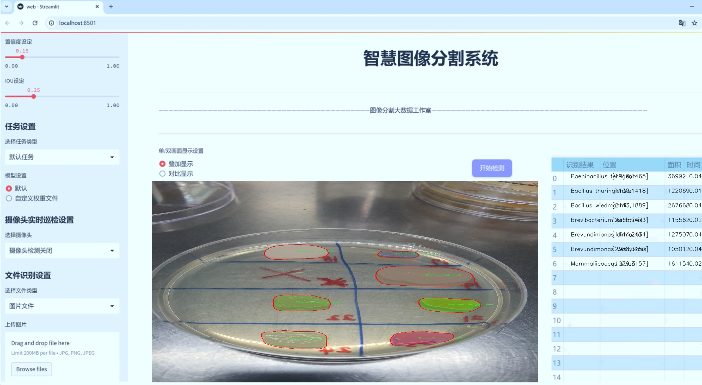
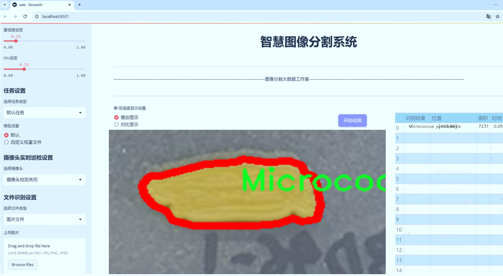
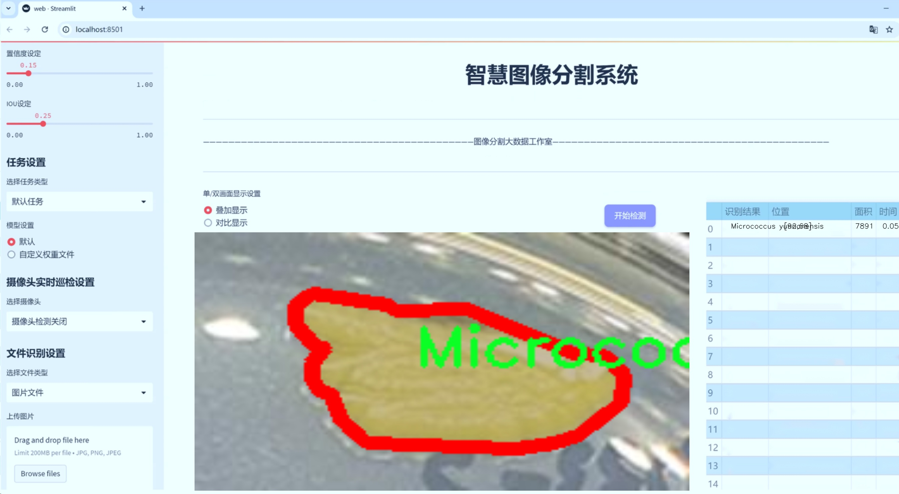
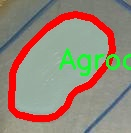
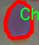
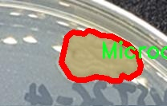
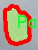
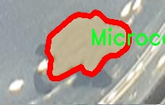

# 细菌实例分割系统源码＆数据集分享
 [yolov8-seg-EfficientFormerV2＆yolov8-seg-SPPF-LSKA等50+全套改进创新点发刊_一键训练教程_Web前端展示]

### 1.研究背景与意义

项目参考[ILSVRC ImageNet Large Scale Visual Recognition Challenge](https://gitee.com/YOLOv8_YOLOv11_Segmentation_Studio/projects)

项目来源[AAAI Global Al lnnovation Contest](https://kdocs.cn/l/cszuIiCKVNis)

研究背景与意义

随着微生物学和生物技术的迅速发展，细菌的分类、识别与分析在环境监测、食品安全、医疗诊断等领域变得愈发重要。细菌的多样性和复杂性使得传统的分类方法面临诸多挑战，而现代计算机视觉技术的进步为细菌的自动化识别和实例分割提供了新的可能性。YOLO（You Only Look Once）系列模型作为一种高效的目标检测算法，因其实时性和准确性在多个领域得到了广泛应用。特别是YOLOv8的推出，进一步提升了目标检测的性能，使其在细菌实例分割任务中展现出良好的应用前景。

在本研究中，我们基于改进的YOLOv8模型，构建了一套细菌实例分割系统，旨在通过对1900幅图像进行分析，识别和分割75种不同细菌。这些细菌包括Acinetobacter、Bacillus、Corynebacterium等多个重要属，涵盖了环境、医药和工业等多个领域的代表性种类。通过对这些细菌的准确识别和分割，不仅可以为微生物分类提供更为高效的工具，还能够为后续的生物学研究和应用提供数据支持。

细菌实例分割的意义在于，它不仅能够帮助科学家们深入理解细菌的形态特征和生物学特性，还能为疾病的早期诊断和监测提供支持。例如，在医疗领域，某些细菌的快速识别与分割能够帮助医生及时采取相应的治疗措施，从而提高患者的治愈率。此外，在食品安全领域，细菌的快速检测和分类能够有效防止食品污染，保障公众健康。

本研究的创新之处在于，通过对YOLOv8模型的改进，提升了细菌实例分割的精度和效率。传统的细菌识别方法往往依赖于人工观察和分类，效率低下且容易受到主观因素的影响。而基于深度学习的自动化方法，能够通过大规模数据训练模型，实现高效、准确的细菌识别。这一转变不仅提高了研究的效率，也为细菌学的研究提供了新的视角。

综上所述，基于改进YOLOv8的细菌实例分割系统，不仅在技术上具有重要的创新意义，更在应用层面展现出广泛的前景。通过这一系统的构建与应用，我们期望能够推动细菌学研究的进展，促进微生物的分类与识别，为环境保护、公共卫生和生物技术的发展贡献力量。

### 2.图片演示







##### 注意：由于此博客编辑较早，上面“2.图片演示”和“3.视频演示”展示的系统图片或者视频可能为老版本，新版本在老版本的基础上升级如下：（实际效果以升级的新版本为准）

  （1）适配了YOLOV8的“目标检测”模型和“实例分割”模型，通过加载相应的权重（.pt）文件即可自适应加载模型。

  （2）支持“图片识别”、“视频识别”、“摄像头实时识别”三种识别模式。

  （3）支持“图片识别”、“视频识别”、“摄像头实时识别”三种识别结果保存导出，解决手动导出（容易卡顿出现爆内存）存在的问题，识别完自动保存结果并导出到tempDir中。

  （4）支持Web前端系统中的标题、背景图等自定义修改，后面提供修改教程。

  另外本项目提供训练的数据集和训练教程,暂不提供权重文件（best.pt）,需要您按照教程进行训练后实现图片演示和Web前端界面演示的效果。

### 3.视频演示

[3.1 视频演示](https://www.bilibili.com/video/BV1d42pYyEMH/)

### 4.数据集信息展示

##### 4.1 本项目数据集详细数据（类别数＆类别名）

nc: 75
names: ['-Brevibacterium- frigoritolerans', 'Acinetobacter johnsonii', 'Acinetobacter lwoffii', 'Acinetobacter pittii', 'Agrococcus baldri', 'Arthrobacter bussei', 'Bacillus aerius', 'Bacillus cereus', 'Bacillus infantis', 'Bacillus licheniformis', 'Bacillus marisflavi', 'Bacillus proteolyticus', 'Bacillus thuringiensis', 'Bacillus wiedmannii', 'Brachybacterium paraconglomeratum', 'Brevibacterium sediminis', 'Brevibacterium senegalense', 'Brevundimonas bullata', 'Brevundimonas diminuta', 'Brevundimonas vesicularis', 'Chryseobacterium cucumeris', 'Chryseobacterium gwangjuense', 'Chryseobacterium taihuense', 'Corynebacterium doosanense', 'Corynebacterium glutamicum', 'Dermacoccus profundi', 'Dietzia cercidiphylli', 'Dietzia cinnamea', 'Exiguobacterium acetylicum', 'Kocuria carniphila', 'Kocuria gwangalliensis', 'Kocuria marina', 'Kocuria oceani', 'Kocuria palustris', 'Kocuria rhizophila', 'Kocuria rosea', 'Kocuria salsicia', 'Leucobacter chromiiresistens', 'Lysinibacillus pakistanensis', 'Lysinibacillus parviboronicapiens', 'Mammaliicoccus sciuri', 'Massilia agri', 'Massilia haematophila', 'Microbacterium arborescens', 'Microbacterium oxydans', 'Microbacterium proteolyticum', 'Microbacterium testaceum', 'Micrococcus aloeverae', 'Micrococcus antarcticus', 'Micrococcus yunnanensis', 'Moraxella osloensis', 'Neomicrococcus lactis', 'Nocardia globerula', 'Paenarthrobacter nicotinovorans', 'Paenibacillus bovis', 'Paenibacillus macquariensis', 'Paenibacillus terrigena', 'Planomicrobium okeanokoites', 'Priestia aryabhattai', 'Priestia megaterium', 'Pseudarthrobacter oxydans', 'Pseudarthrobacter sulfonivorans', 'Pseudomonas parafulva', 'Pseudomonas plecoglossicida', 'Pseudomonas psychrotolerans', 'Pseudomonas putida', 'Pseudomonas straminea', 'Psychrobacillus psychrodurans', 'Rhodococcus biphenylivorans', 'Rhodococcus fascians', 'Rosenbergiella epipactidis', 'Roseomonas mucosa', 'Staphylococcus edaphicus', 'Streptomyces badius', 'Williamsia muralis']


##### 4.2 本项目数据集信息介绍

数据集信息展示

在本研究中，我们采用了名为“ku-al”的数据集，以训练和改进YOLOv8-seg模型，旨在实现高效的细菌实例分割。该数据集包含75个不同的细菌类别，涵盖了广泛的微生物种类，提供了丰富的样本以支持深度学习模型的训练。每个类别都代表了特定的细菌种类，具有独特的形态特征和生物学特性，这为模型的学习和泛化能力提供了良好的基础。

“ku-al”数据集的类别列表包括了一系列重要的细菌，如“Brevibacterium frigoritolerans”、“Acinetobacter johnsonii”、“Bacillus cereus”等。这些细菌在环境、医学和工业等多个领域具有重要的应用价值。例如，某些细菌如“Bacillus thuringiensis”被广泛用于生物农药的开发，而“Pseudomonas putida”则在生物修复和生物降解方面展现出极大的潜力。因此，能够准确地识别和分割这些细菌，对于相关领域的研究和应用具有重要意义。

数据集中的每个类别都经过精心标注，确保了数据的准确性和可靠性。这种高质量的标注不仅有助于模型的训练，还能提高模型在实际应用中的表现。细菌的实例分割任务要求模型能够识别图像中的细菌轮廓，并将其与背景分离，这对于后续的分析和处理至关重要。通过使用“ku-al”数据集，我们希望能够提升YOLOv8-seg在细菌实例分割任务中的精度和效率。

此外，数据集的多样性也是其一大亮点。它包含了多种不同环境下采集的细菌样本，涵盖了不同的生长条件和形态变化。这种多样性使得模型在训练过程中能够接触到更多的变异情况，从而提高其鲁棒性和适应性。研究表明，深度学习模型在面对多样化的数据时，能够更好地学习到特征，从而在未见过的数据上表现出更好的泛化能力。

在训练过程中，我们将利用数据集中的图像和相应的标签，通过不断迭代优化模型参数，以实现更高的分割精度。数据集的规模和复杂性将为模型提供足够的训练样本，使其能够有效地学习到细菌的特征。此外，我们还将采用数据增强技术，以进一步提升模型的性能和稳定性。

总之，“ku-al”数据集为我们改进YOLOv8-seg细菌实例分割系统提供了坚实的基础。通过充分利用该数据集的丰富信息，我们期望能够在细菌识别和分割领域取得突破性进展，为微生物学研究和相关应用提供强有力的支持。











### 5.全套项目环境部署视频教程（零基础手把手教学）

[5.1 环境部署教程链接（零基础手把手教学）](https://www.bilibili.com/video/BV1jG4Ve4E9t/?vd_source=bc9aec86d164b67a7004b996143742dc)


[5.2 安装Python虚拟环境创建和依赖库安装视频教程链接（零基础手把手教学）](https://www.bilibili.com/video/BV1nA4VeYEze/?vd_source=bc9aec86d164b67a7004b996143742dc)

### 6.手把手YOLOV8-seg训练视频教程（零基础小白有手就能学会）

[6.1 手把手YOLOV8-seg训练视频教程（零基础小白有手就能学会）](https://www.bilibili.com/video/BV1cA4VeYETe/?vd_source=bc9aec86d164b67a7004b996143742dc)


按照上面的训练视频教程链接加载项目提供的数据集，运行train.py即可开始训练



     Epoch   gpu_mem       box       obj       cls    labels  img_size
     1/200     0G   0.01576   0.01955  0.007536        22      1280: 100%|██████████| 849/849 [14:42<00:00,  1.04s/it]
               Class     Images     Labels          P          R     mAP@.5 mAP@.5:.95: 100%|██████████| 213/213 [01:14<00:00,  2.87it/s]
                 all       3395      17314      0.994      0.957      0.0957      0.0843

     Epoch   gpu_mem       box       obj       cls    labels  img_size
     2/200     0G   0.01578   0.01923  0.007006        22      1280: 100%|██████████| 849/849 [14:44<00:00,  1.04s/it]
               Class     Images     Labels          P          R     mAP@.5 mAP@.5:.95: 100%|██████████| 213/213 [01:12<00:00,  2.95it/s]
                 all       3395      17314      0.996      0.956      0.0957      0.0845

     Epoch   gpu_mem       box       obj       cls    labels  img_size
     3/200     0G   0.01561    0.0191  0.006895        27      1280: 100%|██████████| 849/849 [10:56<00:00,  1.29it/s]
               Class     Images     Labels          P          R     mAP@.5 mAP@.5:.95: 100%|███████   | 187/213 [00:52<00:00,  4.04it/s]
                 all       3395      17314      0.996      0.957      0.0957      0.0845


### 7.50+种全套YOLOV8-seg创新点代码加载调参视频教程（一键加载写好的改进模型的配置文件）

[7.1 50+种全套YOLOV8-seg创新点代码加载调参视频教程（一键加载写好的改进模型的配置文件）](https://www.bilibili.com/video/BV1Hw4VePEXv/?vd_source=bc9aec86d164b67a7004b996143742dc)

### 8.YOLOV8-seg图像分割算法原理

原始YOLOv8-seg算法原理

YOLOv8-seg算法是YOLO系列中最新的目标检测与分割模型，标志着计算机视觉领域的一次重要进步。该算法不仅在目标检测方面表现出色，还引入了语义分割的能力，使得其在处理复杂场景时更加灵活和高效。YOLOv8-seg的设计理念源于对实时性和精确性的双重追求，旨在满足多种应用场景的需求，如自动驾驶、视频监控和机器人视觉等。

首先，YOLOv8-seg的整体架构由输入层、主干网络、颈部网络和头部网络四个主要部分构成。输入层负责接收图像数据，并对其进行预处理，包括缩放和数据增强等操作，以适应模型的输入要求。通过马赛克数据增强技术，YOLOv8-seg能够在训练过程中生成多样化的图像，从而提高模型的泛化能力和鲁棒性。输入图像经过自适应锚框计算和灰度填充后，进入主干网络进行特征提取。

主干网络是YOLOv8-seg的核心部分，采用了改进的C2f模块和SPPF（Spatial Pyramid Pooling Fusion）结构。C2f模块通过跨层分支连接的方式增强了模型的梯度流，使得特征学习更加高效。与YOLOv7中的E-ELAN结构相似，C2f模块能够有效地捕捉不同层次的特征信息，从而提升模型的特征表示能力。SPPF模块则通过多尺度池化操作，进一步增强了网络对不同尺度目标的感知能力。这种设计使得YOLOv8-seg在处理复杂场景时，能够同时捕捉到大目标和小目标的特征信息。

颈部网络的设计旨在融合来自主干网络的多尺度特征图。YOLOv8-seg采用了路径聚合网络（PAN）结构，能够有效地将不同尺度的特征进行融合，以便于后续的目标检测和分割任务。通过这种特征融合，YOLOv8-seg能够更好地理解图像中的上下文信息，从而提高检测和分割的精度。

在头部网络中，YOLOv8-seg引入了解耦的检测头结构。与传统的耦合头不同，解耦头将分类和回归任务分开处理，允许模型在进行目标检测时，能够更专注于每个任务的优化。具体而言，分类分支采用了二元交叉熵损失（Binary Cross Entropy Loss），而回归分支则结合了分布焦点损失（Distribution Focal Loss）和完全交并比损失（Complete Intersection over Union Loss）。这种设计不仅提高了模型对目标边界框的预测精度，还增强了模型对复杂场景的适应能力。

YOLOv8-seg的另一大亮点在于其无锚框检测头的引入。传统的锚框方法在目标检测中存在一定的局限性，尤其是在处理形状和尺寸各异的目标时。YOLOv8-seg通过采用无锚框检测策略，减少了锚框预测的数量，从而加速了非最大抑制（Non-Maximum Suppression，NMS）过程，提高了检测效率。这一创新使得YOLOv8-seg在实时应用中表现得更加出色。

在模型设置方面，YOLOv8-seg提供了多种配置选项，包括深度因子、宽度因子和通道数等参数。这些参数的灵活设置使得用户能够根据具体的应用需求，调整模型的复杂度和性能。例如，较大的深度因子和宽度因子能够使模型变得更深更宽，从而提升其特征学习能力；而较小的参数则有助于保持模型的轻量化，适应边缘计算设备的需求。

综上所述，YOLOv8-seg算法通过一系列创新的设计和优化，成功地将目标检测与语义分割结合在一起，形成了一种高效、灵活且易于部署的计算机视觉解决方案。其在特征提取、特征融合和任务解耦等方面的改进，使得YOLOv8-seg在各种复杂场景中都能展现出卓越的性能，成为当前业界最为流行和成功的模型之一。随着YOLOv8-seg的不断发展和应用，未来的计算机视觉任务将迎来更多的可能性和挑战。


### 9.系统功能展示（检测对象为举例，实际内容以本项目数据集为准）

图9.1.系统支持检测结果表格显示

  图9.2.系统支持置信度和IOU阈值手动调节

  图9.3.系统支持自定义加载权重文件best.pt(需要你通过步骤5中训练获得)

  图9.4.系统支持摄像头实时识别

  图9.5.系统支持图片识别

  图9.6.系统支持视频识别

  图9.7.系统支持识别结果文件自动保存

  图9.8.系统支持Excel导出检测结果数据


### 10.50+种全套YOLOV8-seg创新点原理讲解（非科班也可以轻松写刊发刊，V11版本正在科研待更新）

#### 10.1 由于篇幅限制，每个创新点的具体原理讲解就不一一展开，具体见下列网址中的创新点对应子项目的技术原理博客网址【Blog】：


[10.1 50+种全套YOLOV8-seg创新点原理讲解链接](https://gitee.com/qunmasj/good)

#### 10.2 部分改进模块原理讲解(完整的改进原理见上图和技术博客链接)【此小节的图要是加载失败请移步原始博客查看，链接：https://blog.csdn.net/cheng2333333?type=blog】
### YOLOv8简介
目前YOLO系列的SOTA模型是ultralytics公司于2023年发布的YOLOv8.按照模型宽度和深度不同分为YOLOv8n、YOLOv8s、YOLOv8m、YOLOv81、YOLOv8x五个版本。本文改进的是 YOLOv8n模型。
YOLOv8的 Backbone采用CSPDarknet结构，它是 Darknet 的一种改进，引入CSP改善网络结构。CSPDarknet把特征图分为两部分，一部分进行卷积操作，另一部分进行跳跃连接，在保持网络深度的同时减少参数量和计算量，提高网络效率。Neck 部分采用特征金字塔PANet[17]，通过自顶向下路径结合和自底向上特征传播进行多尺度融合。损失函数采用了CIloU[18]。YOLOv8的网络结构如图所示。


### ParC融合位置感知循环卷积简介
ParC：Position aware circular convolution


#### Position aware circular convolution
针对于全局信息的提取作者提出了Position aware circular convolution（也称作Global Circular Convolution）。图中左右实际是对于该操作水平竖直两方向的对称，理解时只看左边即可。对于维度为C*H*W的输入，作者先将维度为C*B*1的Position Embedding通过双线性插值函数F调整到适合input的维度C*H*1（以适应不同特征大小输入），并且将PE水平复制扩展到C*H*W维度与输入特征相加。这里作者将PE直接设置成为了可学习的参数。

接下来参考该博客将加入PE的特征图竖直方向堆叠，并且同样以插值的方式得到了适应输入维度的C*H*1大小的卷积核，进行卷积操作。对于这一步卷积，作者将之称为循环卷积，并给出了一个卷积示意图。


但个人感觉实际上这个示意图只是为了说明为什么叫循环卷积，对于具体的计算细节还是根据公式理解更好。


进一步，作者给出了这一步的伪代码来便于读者对这一卷积的理解：y=F.conv2D（torch.cat（xp，xp，dim=2），kV），实际上就是将xp堆叠之后使用了一个“条形（或柱形）”卷积核进行简单的卷积操作。（但这样会导致多一次重复卷积，因此在堆叠示意图中只取了前2*H-1行）

可以看到在示意图中特征维度变化如下：C*(2H-1)*W ---C*H*1--->C*H*W，作者特意带上了通道数，并且并没有出现通道数的改变，那么这里所进行的卷积应该是depth wise卷积，通过对文章后续以及论文源码的阅读可以得知这一步进行的就是DW卷积。（we introduce group convolution and point wise convolution into these modules, which decreases number of parameters without hurting performance.）


由groups = channel可知使用的是DW卷积
通过上面就完成了一次竖直方向的全局信息交流，同样只要在水平方向进行同样的操作即可做到水平方向的全局信息交流。

#### ParC block

通过ParC成功解决了全局信息提取的问题，接下来就是针对2）3）两点进行改进。首先是Meta-Former模块，Meta-Former由Token Mixer和Channel Mixer构成，ParC首先满足了Token Mixer的全局信息提取的要求，并且相较于Attention在计算成本上更低。


这里①中的PWC即point wise conv，进一步验证了我们前面对于深度可分离卷积的想法，而GCC-H/V即是前面所说的ParC-H/V。

①构建了Meta-Former中的Token mixer模块，那么最后剩下的问题就是3），替换掉Attention模块之后模型不再data driven。为了解决这一点作者给出了一个channel wise attention，先将特征图（x,C*H*W）进行global average（a,C*1*1）并输入一个MLP生成一个channel wise的权重（w,C*1*1），再将权重与特征图在通道方向相乘得到输出（output = wx,C*H*W）。

#### ParC net
对于ParC net 的搭建，作者直接基于MobileViT，采用了分叉结构（c）完成了网络的搭建。


具体而言作者保留了MobileViT中浅层具有局部感受野的MobileNetV2结构，而将网络深层的ViT block替换成了ParC block，使网络变成了一个pure ConvNet。


### 11.项目核心源码讲解（再也不用担心看不懂代码逻辑）

#### 11.1 ultralytics\models\yolo\model.py

下面是经过精简和注释的核心代码部分：

```python
# 引入YOLO模型相关的类
from ultralytics.engine.model import Model
from ultralytics.models import yolo  # noqa
from ultralytics.nn.tasks import ClassificationModel, DetectionModel, PoseModel, SegmentationModel

class YOLO(Model):
    """YOLO (You Only Look Once) 目标检测模型类。"""

    @property
    def task_map(self):
        """将任务类型映射到相应的模型、训练器、验证器和预测器类。"""
        return {
            'classify': {  # 分类任务
                'model': ClassificationModel,  # 分类模型
                'trainer': yolo.classify.ClassificationTrainer,  # 分类训练器
                'validator': yolo.classify.ClassificationValidator,  # 分类验证器
                'predictor': yolo.classify.ClassificationPredictor,  # 分类预测器
            },
            'detect': {  # 检测任务
                'model': DetectionModel,  # 检测模型
                'trainer': yolo.detect.DetectionTrainer,  # 检测训练器
                'validator': yolo.detect.DetectionValidator,  # 检测验证器
                'predictor': yolo.detect.DetectionPredictor,  # 检测预测器
            },
            'segment': {  # 分割任务
                'model': SegmentationModel,  # 分割模型
                'trainer': yolo.segment.SegmentationTrainer,  # 分割训练器
                'validator': yolo.segment.SegmentationValidator,  # 分割验证器
                'predictor': yolo.segment.SegmentationPredictor,  # 分割预测器
            },
            'pose': {  # 姿态估计任务
                'model': PoseModel,  # 姿态模型
                'trainer': yolo.pose.PoseTrainer,  # 姿态训练器
                'validator': yolo.pose.PoseValidator,  # 姿态验证器
                'predictor': yolo.pose.PosePredictor,  # 姿态预测器
            },
        }
```

### 代码分析与注释：

1. **引入模块**：
   - 从 `ultralytics.engine.model` 导入 `Model` 类，这是YOLO模型的基类。
   - 从 `ultralytics.models` 和 `ultralytics.nn.tasks` 导入不同的模型类，分别用于分类、检测、分割和姿态估计任务。

2. **YOLO类**：
   - 继承自 `Model` 类，表示YOLO目标检测模型。

3. **task_map属性**：
   - 使用 `@property` 装饰器定义一个只读属性 `task_map`，用于将不同的任务类型（如分类、检测、分割和姿态估计）映射到相应的模型、训练器、验证器和预测器。
   - 每个任务类型都是一个字典，包含以下四个关键字：
     - `model`：对应的模型类。
     - `trainer`：用于训练的类。
     - `validator`：用于验证的类。
     - `predictor`：用于预测的类。

通过这种结构，YOLO类能够灵活地处理不同的计算机视觉任务，并为每种任务提供相应的实现。

这个文件定义了一个名为 `YOLO` 的类，继承自 `Model` 类，主要用于实现 YOLO（You Only Look Once）目标检测模型。YOLO 是一种流行的实时目标检测算法，能够在单个前向传播中同时预测多个目标的类别和位置。

在这个类中，有一个名为 `task_map` 的属性方法。这个方法返回一个字典，字典的结构将不同的任务类型（如分类、检测、分割和姿态估计）映射到相应的模型、训练器、验证器和预测器类。具体来说：

- 对于 `classify` 任务，映射到 `ClassificationModel` 及其对应的训练、验证和预测类。
- 对于 `detect` 任务，映射到 `DetectionModel` 及其对应的训练、验证和预测类。
- 对于 `segment` 任务，映射到 `SegmentationModel` 及其对应的训练、验证和预测类。
- 对于 `pose` 任务，映射到 `PoseModel` 及其对应的训练、验证和预测类。

这种设计使得 `YOLO` 类能够灵活地处理不同类型的任务，通过 `task_map` 属性，可以方便地获取与特定任务相关的模型和工具。这种结构化的方式使得代码更具可读性和可维护性，同时也为扩展其他任务提供了便利。整体来看，这个文件为 YOLO 模型的实现提供了基础框架，支持多种计算机视觉任务的处理。

#### 11.2 ui.py

```python
import sys
import subprocess

def run_script(script_path):
    """
    使用当前 Python 环境运行指定的脚本。

    Args:
        script_path (str): 要运行的脚本路径

    Returns:
        None
    """
    # 获取当前 Python 解释器的路径
    python_path = sys.executable

    # 构建运行命令，使用 streamlit 运行指定的脚本
    command = f'"{python_path}" -m streamlit run "{script_path}"'

    # 执行命令
    result = subprocess.run(command, shell=True)
    # 检查命令执行结果，如果返回码不为0，则表示出错
    if result.returncode != 0:
        print("脚本运行出错。")

# 实例化并运行应用
if __name__ == "__main__":
    # 指定要运行的脚本路径
    script_path = "web.py"  # 这里可以替换为实际的脚本路径

    # 调用函数运行脚本
    run_script(script_path)
```

### 代码注释说明：
1. **导入模块**：
   - `sys`：用于获取当前 Python 解释器的路径。
   - `subprocess`：用于执行外部命令。

2. **定义 `run_script` 函数**：
   - 函数接收一个参数 `script_path`，表示要运行的 Python 脚本的路径。
   - 使用 `sys.executable` 获取当前 Python 解释器的路径，以便在命令中调用。

3. **构建命令**：
   - 使用 f-string 构建命令字符串，命令格式为 `python -m streamlit run script_path`，用于运行指定的 Streamlit 应用。

4. **执行命令**：
   - 使用 `subprocess.run` 执行构建的命令，并通过 `shell=True` 允许在 shell 中执行命令。
   - 检查命令的返回码，如果返回码不为0，表示脚本运行出错，打印错误信息。

5. **主程序入口**：
   - 在 `if __name__ == "__main__":` 块中，指定要运行的脚本路径，并调用 `run_script` 函数执行该脚本。

这个程序文件名为 `ui.py`，主要功能是通过当前的 Python 环境来运行一个指定的脚本，具体是一个名为 `web.py` 的文件。程序首先导入了必要的模块，包括 `sys`、`os` 和 `subprocess`，以及一个自定义的 `abs_path` 函数，这个函数可能用于获取文件的绝对路径。

在 `run_script` 函数中，程序接收一个参数 `script_path`，这个参数是要运行的脚本的路径。函数内部首先获取当前 Python 解释器的路径，这通过 `sys.executable` 实现。接着，程序构建了一个命令字符串，这个命令使用了 `streamlit` 模块来运行指定的脚本。具体来说，命令格式为 `"{python_path}" -m streamlit run "{script_path}"`，其中 `python_path` 是当前 Python 解释器的路径，`script_path` 是传入的脚本路径。

然后，程序使用 `subprocess.run` 来执行这个命令。`shell=True` 参数表示在一个新的 shell 中执行命令。执行后，程序检查命令的返回码，如果返回码不为 0，表示脚本运行出错，程序会打印出错误信息。

在文件的最后部分，使用 `if __name__ == "__main__":` 语句来确保只有在直接运行这个文件时才会执行后面的代码。这里指定了要运行的脚本路径 `web.py`，并调用 `run_script` 函数来执行这个脚本。

总的来说，这个程序的主要目的是提供一个简单的接口，通过命令行运行一个 Streamlit 应用脚本，并处理可能出现的错误。

#### 11.3 ultralytics\models\nas\val.py

以下是代码中最核心的部分，并附上详细的中文注释：

```python
import torch
from ultralytics.utils import ops

class NASValidator:
    """
    Ultralytics YOLO NAS 验证器，用于目标检测。

    该类用于对 YOLO NAS 模型生成的原始预测结果进行后处理。它执行非最大抑制（NMS），以去除重叠和低置信度的框，最终生成最终检测结果。
    """

    def postprocess(self, preds_in):
        """对预测输出应用非最大抑制（NMS）。"""
        # 将预测框从 xyxy 格式转换为 xywh 格式
        boxes = ops.xyxy2xywh(preds_in[0][0])
        
        # 将框和置信度合并，并调整维度顺序
        preds = torch.cat((boxes, preds_in[0][1]), -1).permute(0, 2, 1)
        
        # 应用非最大抑制，去除重叠框
        return ops.non_max_suppression(preds,
                                       self.args.conf,  # 置信度阈值
                                       self.args.iou,   # IoU 阈值
                                       labels=self.lb,  # 多标签 NMS 的标签
                                       multi_label=False,  # 是否使用多标签
                                       agnostic=self.args.single_cls,  # 是否类别无关
                                       max_det=self.args.max_det,  # 最大检测框数量
                                       max_time_img=0.5)  # 每张图像的最大处理时间
```

### 代码核心部分解释：
1. **导入必要的库**：
   - `torch`：用于张量操作和深度学习计算。
   - `ops`：包含一些操作函数，主要用于处理预测框。

2. **NASValidator 类**：
   - 该类负责处理 YOLO NAS 模型的输出，主要功能是进行后处理以获得最终的检测结果。

3. **postprocess 方法**：
   - 输入参数 `preds_in` 是模型的原始预测结果。
   - 使用 `ops.xyxy2xywh` 将预测框的坐标格式从 `(x1, y1, x2, y2)` 转换为 `(x_center, y_center, width, height)` 格式，便于后续处理。
   - 将框和对应的置信度合并为一个张量，并调整维度顺序以适应后续操作。
   - 调用 `ops.non_max_suppression` 方法进行非最大抑制，去除重叠的框，保留置信度高的框，最终返回处理后的检测结果。

这个程序文件是一个用于对象检测的验证器，名为 `NASValidator`，它是基于 Ultralytics YOLO NAS 模型构建的。该类继承自 `DetectionValidator`，其主要功能是对 YOLO NAS 模型生成的原始预测结果进行后处理，具体包括应用非极大值抑制（NMS）来去除重叠和低置信度的边界框，从而最终生成检测结果。

在这个类中，有几个重要的属性和方法。首先，`args` 是一个命名空间对象，包含了用于后处理的各种配置，例如置信度和 IoU（交并比）阈值。`lb` 是一个可选的张量，用于多标签 NMS。

在使用示例中，用户可以通过导入 `NAS` 类来创建模型实例，并获取其验证器。然后，假设已经有了原始预测结果 `raw_preds`，可以调用 `postprocess` 方法来处理这些预测，得到最终的检测结果。

`postprocess` 方法是该类的核心功能，它接受原始预测作为输入，并首先将边界框从 xyxy 格式转换为 xywh 格式。接着，它将边界框和对应的置信度合并，并通过调用 `ops.non_max_suppression` 方法来执行非极大值抑制，最终返回处理后的检测结果。

需要注意的是，这个类通常不会被直接实例化，而是在 `NAS` 类内部使用。这样设计使得用户在使用 YOLO NAS 模型时，可以方便地进行预测结果的后处理，而不需要关心具体的实现细节。

#### 11.4 ultralytics\models\yolo\detect\val.py

以下是经过简化和注释的核心代码部分，主要集中在YOLO检测验证器的实现上：

```python
import os
import torch
from ultralytics.engine.validator import BaseValidator
from ultralytics.utils import LOGGER, ops
from ultralytics.utils.metrics import DetMetrics, box_iou
from ultralytics.utils.plotting import output_to_target, plot_images

class DetectionValidator(BaseValidator):
    """
    基于检测模型的验证器类，继承自BaseValidator。
    """

    def __init__(self, dataloader=None, save_dir=None, pbar=None, args=None, _callbacks=None):
        """初始化检测模型所需的变量和设置。"""
        super().__init__(dataloader, save_dir, pbar, args, _callbacks)
        self.metrics = DetMetrics(save_dir=self.save_dir)  # 初始化检测指标
        self.iouv = torch.linspace(0.5, 0.95, 10)  # mAP@0.5:0.95的IoU向量
        self.niou = self.iouv.numel()  # IoU的数量

    def preprocess(self, batch):
        """对YOLO训练的图像批次进行预处理。"""
        # 将图像移动到设备上并归一化
        batch['img'] = batch['img'].to(self.device, non_blocking=True) / 255
        batch['img'] = batch['img'].half() if self.args.half else batch['img'].float()
        for k in ['batch_idx', 'cls', 'bboxes']:
            batch[k] = batch[k].to(self.device)  # 将标签和边界框移动到设备上
        return batch

    def postprocess(self, preds):
        """对预测输出应用非极大值抑制（NMS）。"""
        return ops.non_max_suppression(preds, self.args.conf, self.args.iou)

    def update_metrics(self, preds, batch):
        """更新检测指标。"""
        for si, pred in enumerate(preds):
            idx = batch['batch_idx'] == si  # 获取当前批次的索引
            cls = batch['cls'][idx]  # 获取当前批次的类标签
            bbox = batch['bboxes'][idx]  # 获取当前批次的边界框
            npr = pred.shape[0]  # 当前批次的预测数量

            if npr == 0:  # 如果没有预测
                continue

            # 处理预测框
            predn = pred.clone()  # 克隆预测
            # 将预测框从图像空间转换到原始空间
            ops.scale_boxes(batch['img'][si].shape[1:], predn[:, :4], batch['ori_shape'][si])

            # 计算IoU并更新指标
            if cls.shape[0] > 0:  # 如果有标签
                correct_bboxes = self._process_batch(predn, torch.cat((cls, bbox), 1))
            else:
                correct_bboxes = torch.zeros(npr, self.niou, dtype=torch.bool, device=self.device)

            self.stats.append((correct_bboxes, pred[:, 4], pred[:, 5], cls.squeeze(-1)))  # 记录统计信息

    def get_stats(self):
        """返回指标统计信息和结果字典。"""
        stats = [torch.cat(x, 0).cpu().numpy() for x in zip(*self.stats)]  # 转换为numpy数组
        if len(stats) and stats[0].any():
            self.metrics.process(*stats)  # 处理指标
        return self.metrics.results_dict  # 返回结果字典

    def plot_predictions(self, batch, preds, ni):
        """在输入图像上绘制预测的边界框并保存结果。"""
        plot_images(batch['img'],
                    *output_to_target(preds),
                    paths=batch['im_file'],
                    fname=self.save_dir / f'val_batch{ni}_pred.jpg',
                    names=self.names)

    def _process_batch(self, detections, labels):
        """
        返回正确的预测矩阵。

        参数:
            detections (torch.Tensor): 形状为[N, 6]的检测张量，每个检测的格式为: x1, y1, x2, y2, conf, class。
            labels (torch.Tensor): 形状为[M, 5]的标签张量，每个标签的格式为: class, x1, y1, x2, y2。

        返回:
            (torch.Tensor): 形状为[N, 10]的正确预测矩阵，表示10个IoU级别。
        """
        iou = box_iou(labels[:, 1:], detections[:, :4])  # 计算IoU
        return self.match_predictions(detections[:, 5], labels[:, 0], iou)  # 匹配预测和标签
```

### 代码注释说明：
1. **DetectionValidator类**：这是一个用于YOLO模型验证的类，继承自`BaseValidator`。
2. **__init__方法**：初始化验证器的基本设置，包括检测指标和IoU向量。
3. **preprocess方法**：对输入的图像批次进行预处理，包括设备转移和归一化。
4. **postprocess方法**：对模型的预测结果应用非极大值抑制（NMS），以减少重复的检测框。
5. **update_metrics方法**：更新检测指标，计算预测的正确性并记录统计信息。
6. **get_stats方法**：返回当前的指标统计信息和结果字典。
7. **plot_predictions方法**：将预测的边界框绘制在输入图像上并保存结果。
8. **_process_batch方法**：计算并返回正确的预测矩阵，基于IoU值进行匹配。

以上是YOLO检测验证器的核心部分及其详细注释，便于理解其功能和实现逻辑。

这个程序文件是Ultralytics YOLO模型的验证模块，主要用于对目标检测模型进行验证和评估。程序的核心是`DetectionValidator`类，它继承自`BaseValidator`类，提供了一系列方法来处理数据、计算指标、保存结果等。

在初始化时，`DetectionValidator`类接收一些参数，包括数据加载器、保存目录、进度条、参数字典和回调函数。它会设置一些必要的变量，如每个类别的目标数量、是否使用COCO数据集、类别映射等。同时，它还初始化了一些评估指标，包括检测指标和混淆矩阵。

`preprocess`方法用于对输入的图像批次进行预处理，将图像转换为适合YOLO模型的格式，并将标签和边界框也转换到相应的设备上。如果启用了混合保存模式，它还会为自动标注准备数据。

`init_metrics`方法用于初始化评估指标，检查数据集是否为COCO格式，并根据需要设置类别映射和保存JSON的标志。

`get_desc`方法返回一个格式化的字符串，用于描述每个类别的评估指标。

`postprocess`方法应用非极大值抑制（NMS）来处理模型的预测输出，以减少冗余的检测框。

`update_metrics`方法负责更新模型的评估指标。它会遍历每个预测结果，计算正确的边界框，并将结果存储在统计信息中。

`finalize_metrics`方法在所有验证完成后设置最终的指标值和混淆矩阵。

`get_stats`方法返回计算得到的指标统计信息和结果字典。

`print_results`方法用于打印训练或验证集的每个类别的指标，包括图像数量、实例数量和各种评估指标。如果没有找到标签，它会发出警告。

`_process_batch`方法用于处理每个批次的检测结果，计算IoU（交并比）并返回正确的预测矩阵。

`build_dataset`和`get_dataloader`方法用于构建YOLO数据集和数据加载器，以便在验证过程中使用。

`plot_val_samples`和`plot_predictions`方法用于可视化验证样本和模型的预测结果，并将其保存为图像文件。

`save_one_txt`方法将YOLO检测结果保存为文本文件，格式为归一化坐标。

`pred_to_json`方法将YOLO的预测结果序列化为COCO格式的JSON，以便于后续评估。

`eval_json`方法用于评估YOLO输出的JSON格式，并返回性能统计信息，使用pycocotools库计算mAP（平均精度均值）。

整体来看，这个文件实现了YOLO模型验证的完整流程，包括数据预处理、指标计算、结果保存和可视化等功能，为模型的性能评估提供了便利。

#### 11.5 utils.py

以下是代码中最核心的部分，并附上详细的中文注释：

```python
import os
import cv2
import pandas as pd
import streamlit as st
from PIL import Image
from QtFusion.path import abs_path

def save_uploaded_file(uploaded_file):
    """
    保存上传的文件到服务器上。

    Args:
        uploaded_file (UploadedFile): 通过Streamlit上传的文件。

    Returns:
        str: 保存文件的完整路径，如果没有文件上传则返回 None。
    """
    # 检查是否有文件上传
    if uploaded_file is not None:
        base_path = "tempDir"  # 定义文件保存的基本路径

        # 如果路径不存在，创建这个路径
        if not os.path.exists(base_path):
            os.makedirs(base_path)
        # 获取文件的完整路径
        file_path = os.path.join(base_path, uploaded_file.name)

        # 以二进制写模式打开文件
        with open(file_path, "wb") as f:
            f.write(uploaded_file.getbuffer())  # 写入文件

        return file_path  # 返回文件路径

    return None  # 如果没有文件上传，返回 None


def concat_results(result, location, confidence, time):
    """
    显示检测结果。

    Args:
        result (str): 检测结果。
        location (str): 检测位置。
        confidence (str): 置信度。
        time (str): 检测用时。

    Returns:
        DataFrame: 包含检测结果的 DataFrame。
    """
    # 创建一个包含这些信息的 DataFrame
    result_data = {
        "识别结果": [result],
        "位置": [location],
        "置信度": [confidence],
        "用时": [time]
    }

    results_df = pd.DataFrame(result_data)  # 将结果数据转换为 DataFrame
    return results_df  # 返回结果 DataFrame


def get_camera_names():
    """
    获取可用摄像头名称列表。

    Returns:
        list: 返回包含“未启用摄像头”和可用摄像头索引号的列表。
    """
    camera_names = ["摄像头检测关闭", "0"]  # 初始化摄像头名称列表
    max_test_cameras = 10  # 定义要测试的最大摄像头数量

    # 测试可用的摄像头
    for i in range(max_test_cameras):
        cap = cv2.VideoCapture(i, cv2.CAP_DSHOW)  # 尝试打开摄像头
        if cap.isOpened() and str(i) not in camera_names:  # 检查摄像头是否成功打开
            camera_names.append(str(i))  # 添加可用摄像头的索引
            cap.release()  # 释放摄像头资源
    if len(camera_names) == 1:
        st.write("未找到可用的摄像头")  # 如果没有找到可用摄像头，输出提示信息
    return camera_names  # 返回可用摄像头名称列表
```

### 代码说明：
1. **保存上传的文件**：`save_uploaded_file` 函数用于保存用户通过 Streamlit 上传的文件到服务器的指定目录，并返回文件的完整路径。
2. **显示检测结果**：`concat_results` 函数将检测结果、位置、置信度和用时等信息整理成一个 Pandas DataFrame，以便后续处理或展示。
3. **获取可用摄像头**：`get_camera_names` 函数尝试打开多个摄像头并返回可用的摄像头索引列表，方便用户选择。

这个程序文件 `utils.py` 包含了一些用于处理文件上传、显示检测结果、加载默认图片以及获取可用摄像头名称的实用函数。

首先，`save_uploaded_file` 函数用于保存用户通过 Streamlit 上传的文件。它接收一个参数 `uploaded_file`，这是用户上传的文件对象。函数首先检查是否有文件被上传，如果有，则定义一个基本路径 `tempDir` 用于存储文件。如果该路径不存在，函数会创建这个目录。接着，函数获取上传文件的完整路径，并以二进制写模式打开文件，将其内容写入到指定路径中。最后，函数返回保存文件的完整路径，如果没有文件上传，则返回 `None`。

接下来，`concat_results` 函数用于显示检测结果。它接收四个参数：`result`（检测结果）、`location`（检测位置）、`confidence`（置信度）和 `time`（检测用时）。函数将这些信息组织成一个字典，并使用 Pandas 创建一个 DataFrame 对象，最终返回这个 DataFrame，方便后续的结果展示。

`load_default_image` 函数用于加载默认图片。它不接受任何参数，返回一个图片对象。函数通过调用 `abs_path` 函数获取默认图片的绝对路径，然后使用 PIL 库打开该图片并返回。

最后，`get_camera_names` 函数用于获取可用摄像头的名称列表。函数初始化一个包含“摄像头检测关闭”和索引“0”的列表，然后定义一个最大测试摄像头数量 `max_test_cameras`。通过循环，函数尝试打开每个索引号的摄像头，如果成功打开，则将该索引号添加到摄像头名称列表中。循环结束后，如果没有找到可用的摄像头，函数会通过 Streamlit 输出一条提示信息。最终，函数返回包含所有可用摄像头名称的列表。

总体来说，这个文件提供了一些基本的工具函数，方便在使用 Streamlit 进行图像处理和摄像头操作时进行文件管理和结果展示。

#### 11.6 train.py

以下是代码中最核心的部分，并附上详细的中文注释：

```python
import os
import torch
import yaml
from ultralytics import YOLO  # 导入YOLO模型

if __name__ == '__main__':  # 确保该模块被直接运行时才执行以下代码
    # 设置训练参数
    workers = 1  # 数据加载的工作进程数
    batch = 8  # 每个批次的样本数量
    device = "0" if torch.cuda.is_available() else "cpu"  # 判断是否使用GPU

    # 获取数据集的yaml配置文件的绝对路径
    data_path = abs_path(f'datasets/data/data.yaml', path_type='current')

    # 读取YAML文件，保持原有顺序
    with open(data_path, 'r') as file:
        data = yaml.load(file, Loader=yaml.FullLoader)

    # 修改YAML文件中的路径项，确保路径正确
    if 'train' in data and 'val' in data and 'test' in data:
        directory_path = os.path.dirname(data_path)  # 获取目录路径
        data['train'] = directory_path + '/train'  # 更新训练集路径
        data['val'] = directory_path + '/val'      # 更新验证集路径
        data['test'] = directory_path + '/test'    # 更新测试集路径

        # 将修改后的数据写回YAML文件
        with open(data_path, 'w') as file:
            yaml.safe_dump(data, file, sort_keys=False)

    # 加载YOLO模型，指定配置文件和预训练权重
    model = YOLO(r"C:\codeseg\codenew\50+种YOLOv8算法改进源码大全和调试加载训练教程（非必要）\改进YOLOv8模型配置文件\yolov8-seg-C2f-Faster.yaml").load("./weights/yolov8s-seg.pt")

    # 开始训练模型
    results = model.train(
        data=data_path,  # 指定训练数据的配置文件路径
        device=device,  # 使用指定的设备进行训练
        workers=workers,  # 使用的工作进程数
        imgsz=640,  # 输入图像的大小为640x640
        epochs=100,  # 训练100个epoch
        batch=batch,  # 每个批次的大小为8
    )
```

### 代码核心部分说明：
1. **导入必要的库**：导入了操作系统、PyTorch、YAML处理库和YOLO模型库。
2. **设置训练参数**：定义了工作进程数、批次大小和设备类型（GPU或CPU）。
3. **读取和修改YAML配置文件**：读取数据集的配置文件，更新训练、验证和测试集的路径，并将修改后的内容写回文件。
4. **加载YOLO模型**：根据指定的配置文件和预训练权重加载YOLO模型。
5. **训练模型**：调用模型的训练方法，传入必要的参数以开始训练过程。

该程序文件 `train.py` 是一个用于训练 YOLO（You Only Look Once）模型的脚本。首先，程序导入了必要的库，包括 `os`、`torch`、`yaml` 和 `ultralytics` 中的 YOLO 模型。程序还使用了 `matplotlib` 来设置图形后端为 `TkAgg`，以便在需要时进行可视化。

在 `__main__` 代码块中，程序首先设置了一些训练参数，包括工作进程数 `workers` 和批次大小 `batch`。批次大小可以根据计算机的显存和内存进行调整，如果显存不足，可以适当降低该值。接着，程序检查是否有可用的 GPU，如果有，则将设备设置为 "0"（即第一个 GPU），否则使用 CPU。

接下来，程序通过调用 `abs_path` 函数获取数据集配置文件 `data.yaml` 的绝对路径，并将其转换为 UNIX 风格的路径。然后，程序获取该路径的目录，并打开 YAML 文件以读取数据。读取后，程序检查数据中是否包含 'train'、'val' 和 'test' 字段，如果有，则将这些字段的路径修改为相对于目录的路径。修改完成后，程序将更新后的数据写回到 YAML 文件中。

在模型加载部分，程序创建了一个 YOLO 模型实例，并加载了指定的配置文件和预训练权重。用户可以根据需要选择不同的模型配置文件。

最后，程序调用 `model.train` 方法开始训练模型。训练过程中指定了训练数据的配置文件路径、设备、工作进程数、输入图像大小（640x640）、训练的轮数（100个 epoch）以及每个批次的大小（8）。这样，程序便可以开始进行模型训练，利用指定的数据集和参数进行学习。

### 12.系统整体结构（节选）

### 整体功能和架构概括

该项目的整体功能是实现一个基于 YOLO（You Only Look Once）模型的目标检测系统。它包括模型的训练、验证、检测、结果展示以及实用工具函数等多个模块。项目结构清晰，各个模块之间通过类和函数进行协作，以实现完整的目标检测流程。

- **模型定义**：在 `ultralytics\models\yolo\model.py` 中定义了 YOLO 模型的结构。
- **训练**：`train.py` 负责模型的训练过程，包括数据集的加载、模型的配置和训练参数的设置。
- **验证**：`ultralytics\models\nas\val.py` 和 `ultralytics\models\yolo\detect\val.py` 提供了验证模型性能的功能，计算指标并处理预测结果。
- **用户界面**：`ui.py` 提供了一个简单的用户界面，允许用户上传文件并运行检测。
- **实用工具**：`utils.py` 包含了一些辅助函数，用于文件处理、结果展示和摄像头获取等。
- **数据增强**：`ultralytics\data\augment.py` 提供了数据增强的功能，以提高模型的泛化能力。
- **回调函数**：`ultralytics\utils\callbacks\tensorboard.py` 和 `ultralytics\utils\callbacks\base.py` 用于在训练过程中记录和可视化训练过程中的指标。
- **模块化设计**：`ultralytics\nn\modules\block.py` 和其他模块提供了模型的不同组件和操作，增强了代码的可重用性和可维护性。

### 文件功能整理表

| 文件路径                                             | 功能描述                                                         |
|-----------------------------------------------------|------------------------------------------------------------------|
| `ultralytics/models/yolo/model.py`                 | 定义 YOLO 模型结构和任务映射。                                   |
| `ui.py`                                            | 提供用户界面，允许文件上传并运行检测脚本。                       |
| `ultralytics/models/nas/val.py`                    | 实现 YOLO NAS 模型的验证功能，处理预测结果并计算指标。          |
| `ultralytics/models/yolo/detect/val.py`            | 实现 YOLO 模型的验证功能，计算指标并处理检测结果。              |
| `utils.py`                                         | 提供实用工具函数，如文件上传、结果展示、加载默认图片等。        |
| `train.py`                                         | 负责模型的训练过程，包括数据集加载、模型配置和训练参数设置。   |
| `ultralytics/utils/callbacks/tensorboard.py`      | 记录和可视化训练过程中的指标，支持 TensorBoard。                |
| `model.py`                                         | 定义模型的基础结构和功能（具体实现未提供）。                    |
| `ultralytics/data/augment.py`                      | 提供数据增强功能，提高模型的泛化能力。                          |
| `ultralytics/utils/callbacks/base.py`              | 定义训练过程中的基本回调功能。                                  |
| `ultralytics/nn/modules/block.py`                  | 定义模型的不同组件和操作，增强代码的可重用性。                  |
| `ultralytics/nn/extra_modules/ops_dcnv3/functions/__init__.py` | 提供额外的操作和功能（具体实现未提供）。                       |
| `ultralytics/utils/autobatch.py`                   | 实现自动批处理功能，优化训练过程中的内存使用。                  |

这个表格整理了项目中各个文件的功能，帮助理解项目的整体架构和各个模块的职责。

注意：由于此博客编辑较早，上面“11.项目核心源码讲解（再也不用担心看不懂代码逻辑）”中部分代码可能会优化升级，仅供参考学习，完整“训练源码”、“Web前端界面”和“50+种创新点源码”以“14.完整训练+Web前端界面+50+种创新点源码、数据集获取”的内容为准。

### 13.图片、视频、摄像头图像分割Demo(去除WebUI)代码

在这个博客小节中，我们将讨论如何在不使用WebUI的情况下，实现图像分割模型的使用。本项目代码已经优化整合，方便用户将分割功能嵌入自己的项目中。
核心功能包括图片、视频、摄像头图像的分割，ROI区域的轮廓提取、类别分类、周长计算、面积计算、圆度计算以及颜色提取等。
这些功能提供了良好的二次开发基础。

### 核心代码解读

以下是主要代码片段，我们会为每一块代码进行详细的批注解释：

```python
import random
import cv2
import numpy as np
from PIL import ImageFont, ImageDraw, Image
from hashlib import md5
from model import Web_Detector
from chinese_name_list import Label_list

# 根据名称生成颜色
def generate_color_based_on_name(name):
    ......

# 计算多边形面积
def calculate_polygon_area(points):
    return cv2.contourArea(points.astype(np.float32))

...
# 绘制中文标签
def draw_with_chinese(image, text, position, font_size=20, color=(255, 0, 0)):
    image_pil = Image.fromarray(cv2.cvtColor(image, cv2.COLOR_BGR2RGB))
    draw = ImageDraw.Draw(image_pil)
    font = ImageFont.truetype("simsun.ttc", font_size, encoding="unic")
    draw.text(position, text, font=font, fill=color)
    return cv2.cvtColor(np.array(image_pil), cv2.COLOR_RGB2BGR)

# 动态调整参数
def adjust_parameter(image_size, base_size=1000):
    max_size = max(image_size)
    return max_size / base_size

# 绘制检测结果
def draw_detections(image, info, alpha=0.2):
    name, bbox, conf, cls_id, mask = info['class_name'], info['bbox'], info['score'], info['class_id'], info['mask']
    adjust_param = adjust_parameter(image.shape[:2])
    spacing = int(20 * adjust_param)

    if mask is None:
        x1, y1, x2, y2 = bbox
        aim_frame_area = (x2 - x1) * (y2 - y1)
        cv2.rectangle(image, (x1, y1), (x2, y2), color=(0, 0, 255), thickness=int(3 * adjust_param))
        image = draw_with_chinese(image, name, (x1, y1 - int(30 * adjust_param)), font_size=int(35 * adjust_param))
        y_offset = int(50 * adjust_param)  # 类别名称上方绘制，其下方留出空间
    else:
        mask_points = np.concatenate(mask)
        aim_frame_area = calculate_polygon_area(mask_points)
        mask_color = generate_color_based_on_name(name)
        try:
            overlay = image.copy()
            cv2.fillPoly(overlay, [mask_points.astype(np.int32)], mask_color)
            image = cv2.addWeighted(overlay, 0.3, image, 0.7, 0)
            cv2.drawContours(image, [mask_points.astype(np.int32)], -1, (0, 0, 255), thickness=int(8 * adjust_param))

            # 计算面积、周长、圆度
            area = cv2.contourArea(mask_points.astype(np.int32))
            perimeter = cv2.arcLength(mask_points.astype(np.int32), True)
            ......

            # 计算色彩
            mask = np.zeros(image.shape[:2], dtype=np.uint8)
            cv2.drawContours(mask, [mask_points.astype(np.int32)], -1, 255, -1)
            color_points = cv2.findNonZero(mask)
            ......

            # 绘制类别名称
            x, y = np.min(mask_points, axis=0).astype(int)
            image = draw_with_chinese(image, name, (x, y - int(30 * adjust_param)), font_size=int(35 * adjust_param))
            y_offset = int(50 * adjust_param)

            # 绘制面积、周长、圆度和色彩值
            metrics = [("Area", area), ("Perimeter", perimeter), ("Circularity", circularity), ("Color", color_str)]
            for idx, (metric_name, metric_value) in enumerate(metrics):
                ......

    return image, aim_frame_area

# 处理每帧图像
def process_frame(model, image):
    pre_img = model.preprocess(image)
    pred = model.predict(pre_img)
    det = pred[0] if det is not None and len(det)
    if det:
        det_info = model.postprocess(pred)
        for info in det_info:
            image, _ = draw_detections(image, info)
    return image

if __name__ == "__main__":
    cls_name = Label_list
    model = Web_Detector()
    model.load_model("./weights/yolov8s-seg.pt")

    # 摄像头实时处理
    cap = cv2.VideoCapture(0)
    while cap.isOpened():
        ret, frame = cap.read()
        if not ret:
            break
        ......

    # 图片处理
    image_path = './icon/OIP.jpg'
    image = cv2.imread(image_path)
    if image is not None:
        processed_image = process_frame(model, image)
        ......

    # 视频处理
    video_path = ''  # 输入视频的路径
    cap = cv2.VideoCapture(video_path)
    while cap.isOpened():
        ret, frame = cap.read()
        ......
```


### 14.完整训练+Web前端界面+50+种创新点源码、数据集获取


# [下载链接：https://mbd.pub/o/bread/ZpyXlpZu](https://mbd.pub/o/bread/ZpyXlpZu)